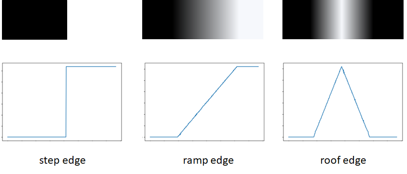
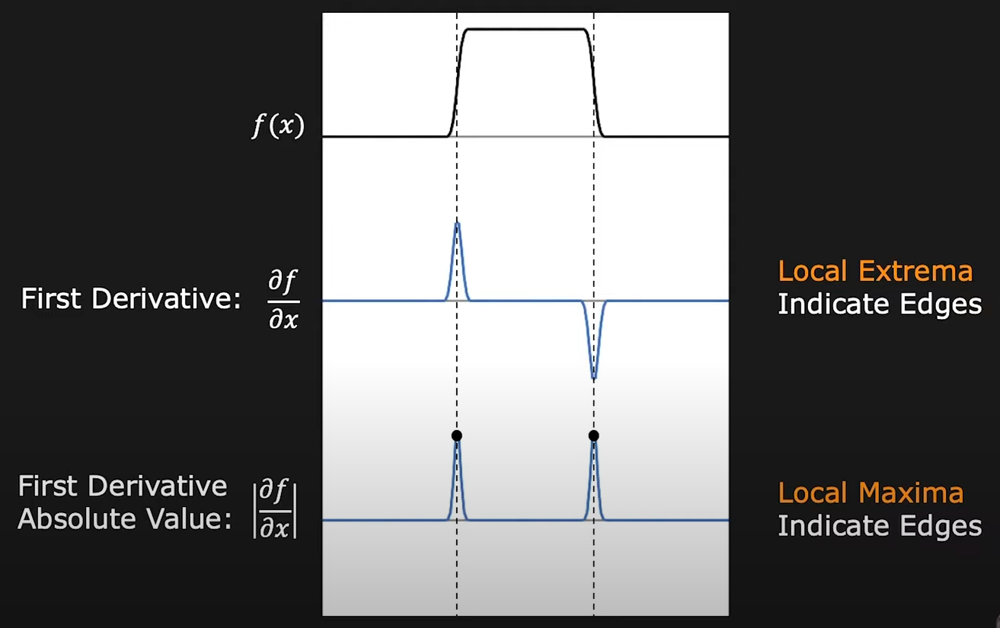
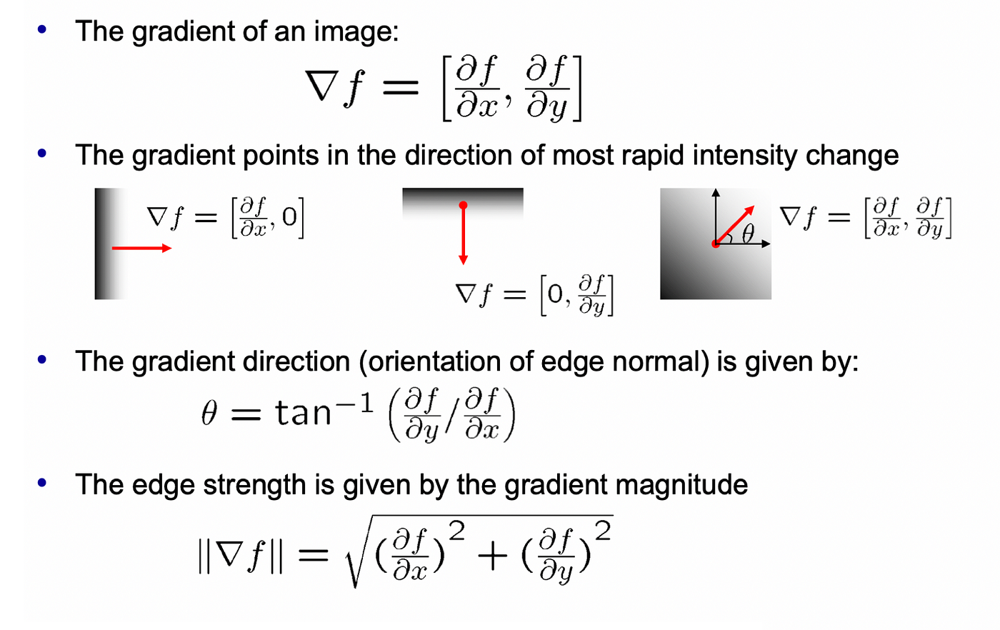
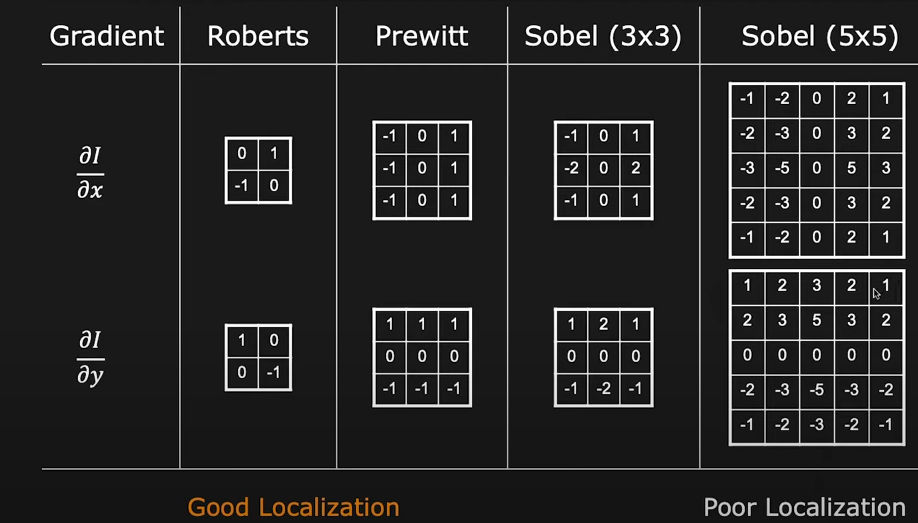
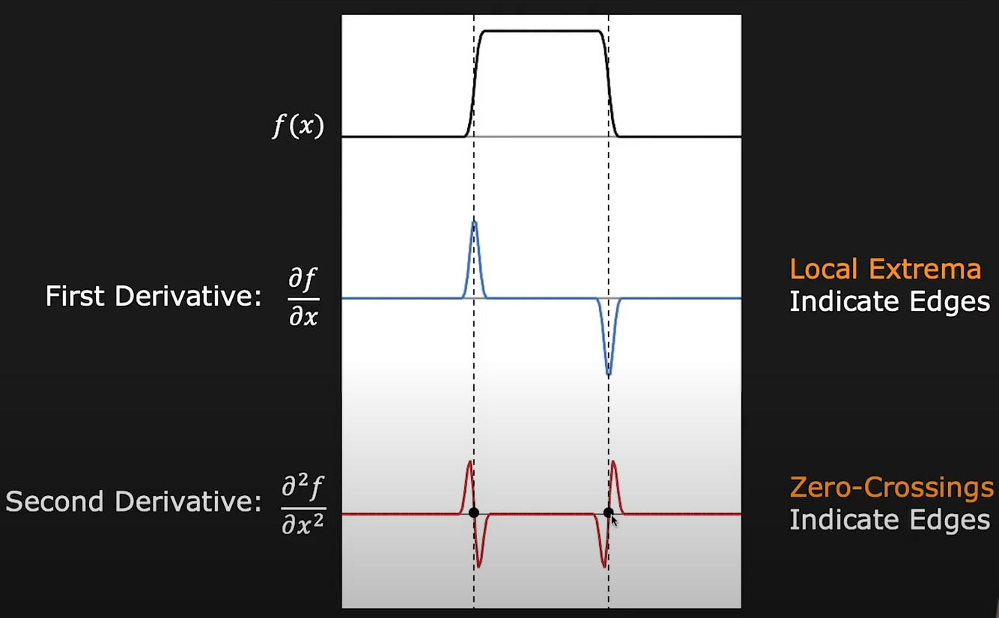
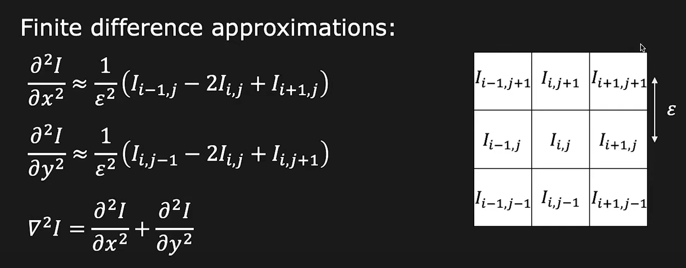
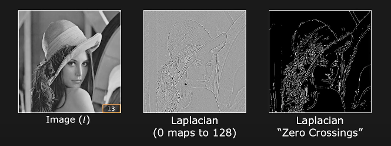
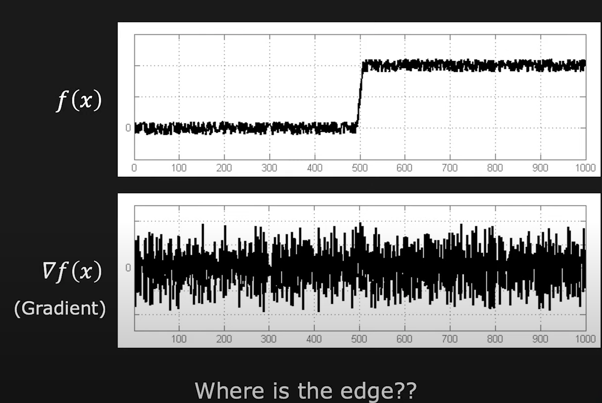

### Content 
1. **What is an Edge?**  
   An edge is a location in an image where there is a rapid change in intensity, typically indicating a boundary between different regions or objects.

2. **Edge Detection Using Gradients**  
   Gradient-based edge detection identifies edges by measuring the change in intensity across neighboring pixels and finding locations with the highest gradient magnitudes.

3. **Edge Detection Using Laplacian**  
   The Laplacian method detects edges by calculating the second derivative of the image intensity, highlighting regions where rapid intensity changes occur.

4. **Canny Edge Detection**  
   The Canny edge detection algorithm uses a multi-stage process to identify edges by smoothing the image, finding gradients, applying non-maximum suppression, and using double thresholding to track edges.

5. **Corner Detection**  
   Corner detection identifies points in an image where there are significant changes in both gradient directions, often indicating the intersection of edges or notable features.

### What Causes Edges?  
Edges in images arise from various physical phenomena where there is a sudden change in intensity:

1. **Surface Normal Discontinuity:** Changes in the orientation of a surface can cause abrupt intensity variations, resulting in edges.

2. **Depth Discontinuity:** Differences in depth between objects or within an object can create sharp changes in intensity.

3. **Surface Reflectance Discontinuity:** Variations in how light is reflected off a surface can lead to noticeable intensity changes and thus edges.

4. **Illumination Discontinuity:** Differences in lighting conditions across different regions of an image can cause sudden changes in intensity, resulting in edges.

#### Types of Edges
1. **Step Edges**: Abrupt changes in intensity, like the boundary between different regions or surfaces.
2. **Roof Edges**: Gradual intensity transitions that can occur due to surface variations or textures.
3. **Line Edges**: Sharp, linear changes in intensity that define the boundary of a line structure.

An edge detector should provide:
1. **Edge Position**: The location where the edge occurs.
2. **Edge Magnitude (Strength)**: The intensity of the edge, indicating how pronounced the change is.
3. **Edge Orientation (Direction)**: The direction of the edge's gradient or change in intensity.

**Performance Requirements:**
- **High Detection Rate**: The ability to accurately identify all relevant edges.
- **Good Localization**: Precise identification of the edge position.
- **Low Noise Sensitivity**: The edge detection should be robust against noise in the image.

#### Types of Edge Detection Algorithms
1. **Gradient-Based**
   - **Sobel Operator**: Measures the gradient of image intensity at each pixel to find edges.
   - **Prewitt Operator**: Similar to Sobel but with different convolution masks for edge detection.
   - **Robert Operator**: Detects edges by computing the difference between diagonally adjacent pixels.

2. **Gaussian-Based**
   - **Canny Edge Detection**: Uses a multi-step process involving Gaussian smoothing, gradient calculation, non-maximum suppression, and edge tracking by hysteresis.
   - **Laplacian of Gaussian (LoG)**: Applies Gaussian smoothing followed by the Laplacian operator to detect edges.

### Gradient-Based Detection
For 1D edge detection, the first derivative of the image intensity is calculated, with local maxima indicating edge points and their values representing edge strength.

For 2D edge detection, partial derivatives are computed along each dimension. The gradient operator indicates the direction of the most rapid intensity change.

In discrete space, gradient approximations are used:
$$
\frac{d}{dx} = \frac{1}{2 \epsilon } \begin{bmatrix}
-1 & 1 \\
-1 & 1
\end{bmatrix}
$$

$$
\frac{d}{dy} = \frac{1}{2 \epsilon } \begin{bmatrix}
1 & 1 \\
-1 & -1
\end{bmatrix}
$$

Small filters are effective for localization because they are less influenced by distant pixels, but they are more sensitive to noise. Large filters reduce noise sensitivity but can suffer from poor localization.

#### Edge Thresholding

**Standard Thresholding:** (Single Threshold \( T \))
- If \( \| \nabla I(x, y) \| < T \): Definitely Not an Edge
- If \( \| \nabla I(x, y) \| \geq T \): Definitely an Edge

**Hysteresis Thresholding:** (Two Thresholds \( T_0 < T_1 \))
- If \( \| \nabla I(x, y) \| < T_0 \): Definitely Not an Edge
- If \( \| \nabla I(x, y) \| \geq T_1 \): Definitely an Edge
- If \( T_0 \leq \| \nabla I(x, y) \| < T_1 \): Considered an Edge if Connected to a Pixel Marked as Definitely an Edge

**Edge Detection Using Second Derivative**
Second derivatives produce strong zero-crossings at edges.

By detecting these zero-crossings, we identify edges. The Laplacian operator \( \nabla^2 \) is used to compute the sum of second derivatives:
$$
\nabla^2 I = \frac{d^2 I}{dx^2} + \frac{d^2 I}{dy^2}
$$
- Edges correspond to zero-crossings in the Laplacian of the image.
- The Laplacian does not provide edge directions.

**Discrete Laplacian Operator**
The Laplacian operator is a second derivative approximation, requiring at least a 3x3 pixel neighborhood:

The convolution masks for the Laplacian operator are:
$$
\nabla^2 = \frac{1}{8 \epsilon } \begin{bmatrix}
0 & 1 & 0 \\
1 & -4 & 1 \\
0 & 1 & 0
\end{bmatrix}
$$
or
$$
\nabla^2 = \frac{1}{6 \epsilon } \begin{bmatrix}
1 & 4 & 1 \\
4 & -20 & 4 \\
1 & 4 & 1
\end{bmatrix}
$$
The latter is often used convolution mask.

### Effect of Noise
Noise introduces rapid intensity variations throughout the image, which can interfere with accurate edge detection. To mitigate this issue, Gaussian smoothing is applied to reduce noise before edge detection.
