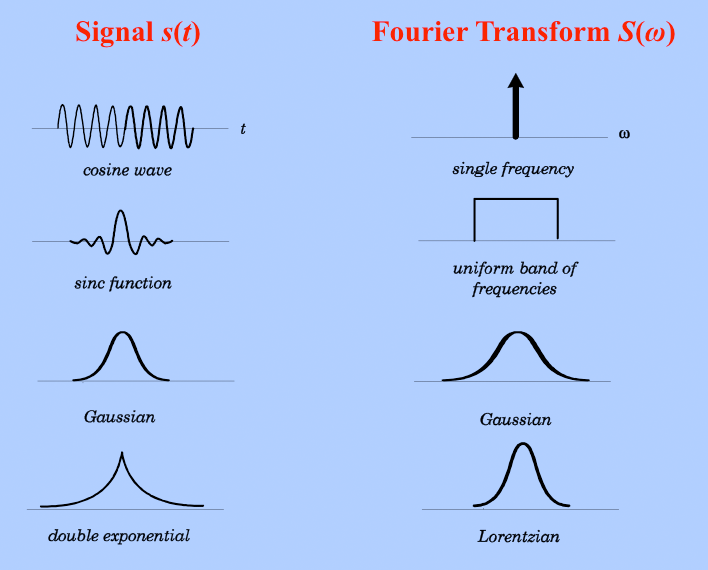
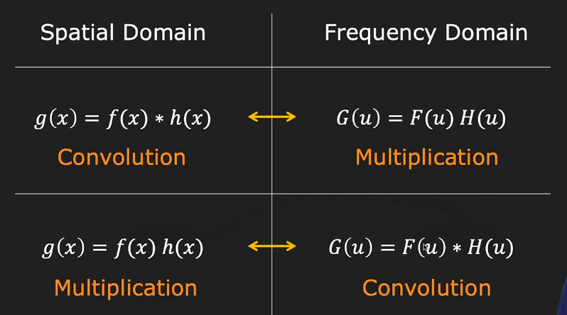
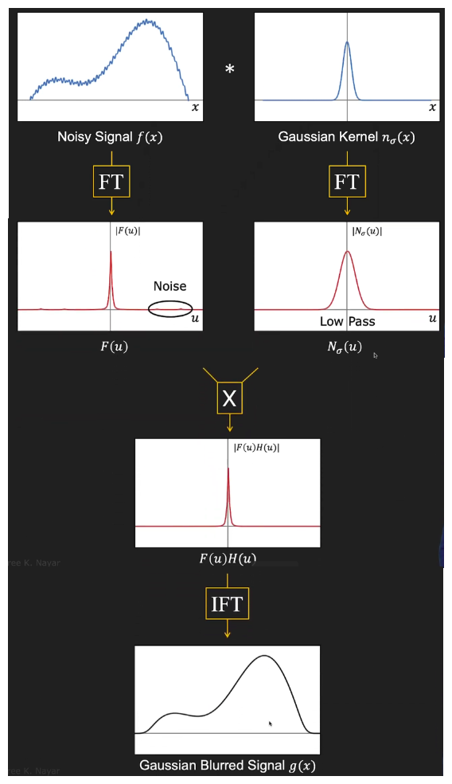
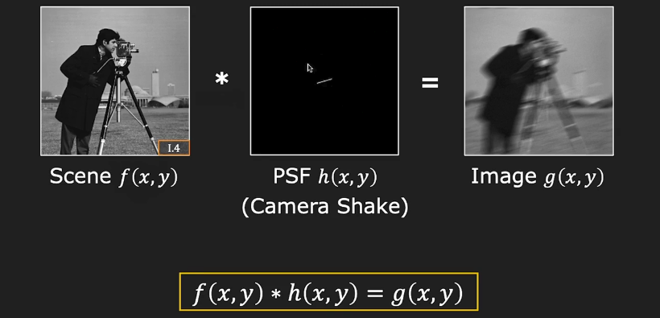
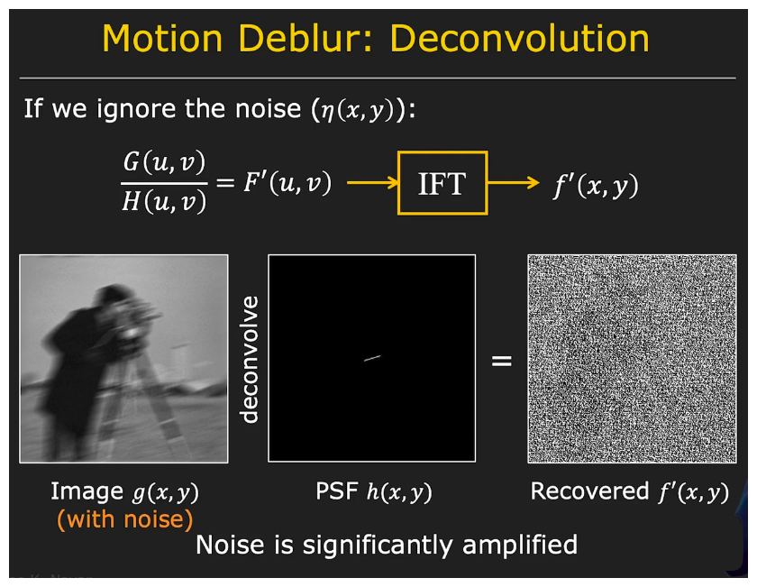
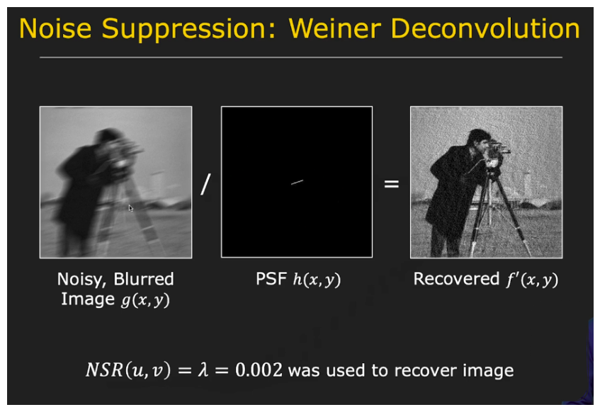
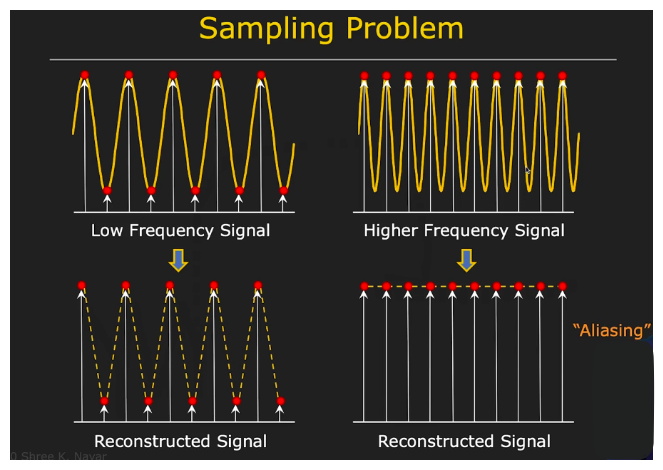
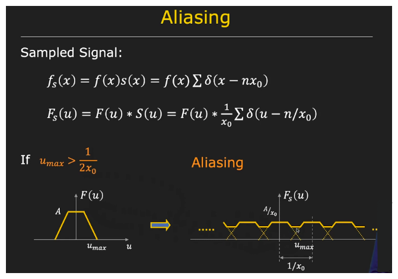

## Image Processing II
The goal of image processing is to transform image to a new one that is clearler or easier to analyze

**Topic Covered**
1. Fourier TRansform
2. Convolution Therorem
3. Deconvolution in Frequency Domain
4. Sampling  Theory and Aliasing

### Furier Transform
Fourier transform is named after Jean Baptiste Josep Fourier(1768-1839). Basic defination of Fourier transform is **Amy Periodic function can be rewritten as a Weighted sum of Infinite Sinusoids of Different Frequencies**

The Fourier Transform is a mathematical operation that transforms a signal from its original domain (often time or space) into the frequency domain. It expresses a function as a sum (or integral) of sinusoidal functions (sine and cosine waves) with varying frequencies, amplitudes, and phases.

Given a time-domain signal $f(t)$, its Fourier Transform $F(\omega)$ is defined as:

$$
F(\omega) = \int_{-\infty}^{\infty} f(t) e^{-i \omega t} \, dt
$$

Where:
- $f(t)$ is the original function in the time domain,
- $\omega$ is the angular frequency,
- $e^{-i \omega t}$ represents a complex sinusoidal function,
- $F(\omega)$ is the transformed function in the frequency domain.

### Inverse Fourier Transform (IFT)
The Inverse Fourier Transform is used to recover the original time-domain signal from its frequency-domain representation. It essentially reverses the process of the Fourier Transform.

Given a frequency-domain function $F(\omega)$, its inverse Fourier Transform $f(t)$ is defined as:

$$
f(t) = \frac{1}{2\pi} \int_{-\infty}^{\infty} F(\omega) e^{i \omega t} \, d\omega
$$

Where:
- $F(\omega)$ is the function in the frequency domain,
- $\omega$ is the angular frequency,
- $e^{i \omega t}$ represents a complex sinusoidal function,
- $f(t)$ is the recovered function in the time domain.

#### Why Fourier transform Complex?

1. **Why Complex?** The Fourier transform uses complex numbers because the coefficient $F(u)$ for a given frequency $u$ needs to capture both the amplitude and the phase of the corresponding sinusoid. This complexity is necessary for the transform to fully and accurately represent the signal.

2. **Positive and Negative Frequencies:** The Fourier transform considers both positive and negative frequencies, not just from zero to infinity. This allows the transform to encompass all frequency components of the signal.

3. **Amplitude and Phase:** For each frequency $u$, the Fourier transform $F(u)$ has real and imaginary components. The amplitude of the sinusoid at that frequency is the square root of the sum of the squares of the real and imaginary parts. The phase is determined by taking the inverse tangent of the imaginary part divided by the real part.

### Properties of Fourier Transform
1. **Linearity:** The Fourier Transform of a sum of functions is the sum of their Fourier Transforms.
2. **Time Shifting:** Shifting a function in time corresponds to a phase shift in its frequency representation.
3. **Frequency Shifting:** Shifting a function in frequency corresponds to a time shift in its time-domain representation.
4. **Scaling:** Rescaling a function in time domain corresponds to inverse scaling in the frequency domain (and vice versa).
5. **Convolution:** The Fourier Transform of a convolution of two functions is the product of their individual Fourier Transforms.

**Applications**
- Signal processing
- Image processing
- Communication systems
- Audio and video compression
- Solving partial differential equations

### Convolution Theorem: Fourier Domain Insight

The **Convolution Theorem** establishes a powerful link between the spatial (or time) domain and the frequency domain:

- **In the spatial domain:** Convolution of two functions is defined as:
  
  $$
  (f * h)(x) = \int_{-\infty}^{\infty} f(t) h(x - t) dt
  $$

- **In the frequency domain:** The Fourier Transform of this convolution is the **pointwise product** of their individual transforms:

  $$
  \mathcal{F}\{f * h\}(u) = \mathcal{F}\{f\}(u) \cdot \mathcal{F}\{h\}(u)
  $$

- **Conversely**, multiplication in the spatial domain corresponds to convolution in the frequency domain:
  
  $$
  \mathcal{F}\{f(x) \cdot h(x)\} = \mathcal{F}\{f\} * \mathcal{F}\{h\}
  $$

#### Why is this useful?

1. **Efficiency**: Convolution with large filters is computationally expensive in the spatial domain. Using the **Fast Fourier Transform (FFT)**, it's significantly faster to perform convolution via frequency multiplication and an inverse transform.
2. **Filter Design & Interpretation**: The frequency-domain view helps interpret how filters affect signal content—e.g., a Gaussian kernel in the frequency domain acts as a **low-pass filter**, suppressing high-frequency noise.

#### Example: Gaussian Smoothing via Fourier Transform

Suppose you have a noisy signal. Instead of directly convolving it with a Gaussian kernel in the spatial domain, you can:

1. Take the **Fourier Transform** of the signal $f$ and the Gaussian kernel $h$.
2. Multiply the two: $F(u) \cdot H(u)$
3. Apply the **Inverse Fourier Transform** to recover the smoothed signal in the spatial domain.

This is especially useful in image processing, where convolution with Gaussian kernels (for denoising) is common.

### Deconvolution and Motion Blur

While convolution is often applied deliberately for filtering, **real-world images can undergo unintentional convolution** due to camera motion or defocus. A common example is **motion blur**, where an image $f(x, y)$ gets convolved with a motion blur kernel $h(x, y)$, resulting in a blurred image $g(x, y)$:

$$
g(x, y) = f(x, y) * h(x, y)
$$

#### Goal of Deconvolution

Given:
- Blurred image $g(x, y)$,
- Known point spread function (PSF) $h(x, y)$ (e.g., from sensor IMU data),

**Objective**: Recover the original image $f(x, y)$ as closely as possible.

#### Frequency Domain Approach

Using the **Convolution Theorem**, we move to the frequency domain:

$$
G(u, v) = F(u, v) \cdot H(u, v)
$$

To recover an estimate $F'(u, v)$:

$$
F'(u, v) = \frac{G(u, v)}{H(u, v)}
$$

Then apply the **Inverse Fourier Transform** to get the recovered image $f'(x, y)$.

#### Problem: Noise Amplification

In real scenarios, captured images also include **additive noise** after blur, resulting in:

$$
g(x, y) = (f * h)(x, y) + n(x, y)
$$

In the frequency domain, division by $H(u, v)$, especially where it's near-zero (as in high frequencies for motion blur), **amplifies noise dramatically**, leading to poor results.

#### Solution: Wiener Deconvolution

Wiener filtering introduces a noise-aware correction term to prevent this amplification:

$$
F'(u, v) = \frac{G(u, v)}{H(u, v)} \cdot \frac{|H(u, v)|^2}{|H(u, v)|^2 + \text{NSR}(u, v)}
$$

Where:
- **NSR**: Noise-to-signal power ratio (can be estimated or set as a constant),
- This factor **attenuates recovery** at noisy or unstable frequencies.

Even with approximate NSR (e.g., a constant value like 0.002), Wiener filtering can significantly **improve visual quality**, reducing ringing artifacts and recovering much of the original image structure.

---

### Summary

- **Standard deconvolution** divides in the frequency domain but is very sensitive to noise.
- **Wiener deconvolution** adds noise suppression, balancing recovery and stability.
- Practical use (e.g., in smartphones) leverages sensor data to estimate motion and restore images affected by blur.

### Sampling and Aliasing in Digital Imaging

When a camera captures a scene, the **lens forms a continuous optical image** on the image plane. This image is then **converted into a digital image** by the image sensor, which performs **sampling**.

#### Why Sampling Matters

To accurately capture the original image:
- Sampling must be **dense enough** to avoid loss of information.
- But not too dense, as it leads to inefficiencies or unnecessary data.

Undersampling leads to **aliasing**, which introduces:
- Loss of fine detail,
- Visual artifacts (e.g., moiré patterns, false textures),
- False frequencies that weren’t in the original signal.

#### 1D Sampling: Concept

Imagine a 1D continuous signal (e.g., a sine wave) being sampled:
- **Proper sampling** reconstructs the original signal well.
- **Undersampling** fails to capture variation, potentially turning a high-frequency wave into a flat line (or worse, a misleading low-frequency signal).

#### Frequency Domain Perspective

Let a continuous signal be $f(x)$. To sample it:
- Multiply it by a **shah function** $s(x)$: a train of delta functions spaced by $x_0$.
- This yields:  
  $$
  f_s(x) = f(x) \cdot s(x)
  $$

In the **Fourier domain**:
- Multiplication becomes convolution:
  $$
  F_s(u) = F(u) * S(u)
  $$
- $S(u)$, the Fourier transform of the shah function, is also a shah function with spacing $\frac{1}{x_0}$.

This results in **multiple shifted copies** of the original spectrum $F(u)$. If the copies **don’t overlap**, the signal is **perfectly recoverable**.

#### Nyquist Theorem

To avoid overlap and aliasing:
$$
u_{\text{max}} \leq \frac{1}{2x_0}
$$
Where:
- $u_{\text{max}}$: highest frequency in the signal,
- $x_0$: sampling interval.

This defines the **Nyquist frequency**:
$$
f_s \geq 2u_{\text{max}}
$$

If this condition is **violated**, overlapping occurs in the frequency domain, making it **impossible to recover the original signal**—aliasing occurs.

#### Visual Aliasing Example

- A well-sampled brick wall image looks normal.
- An undersampled version shows **rippled moiré patterns**—caused by aliasing.

#### Reconstructing the Original Signal

If well-sampled:
1. Multiply the spectrum $F_s(u)$ with a **rectangular window** (low-pass filter):
   $$
   c(u) = x_0 \text{ if } |u| < \frac{1}{2x_0}, \text{ else } 0
   $$
2. Take the **inverse Fourier transform** to recover $f(x)$.

---

### Preventing Aliasing in Camera Systems

Even though the scene’s frequencies can’t be controlled, the **image formation process** can help prevent aliasing using:

1. **Pixel integration (box filtering)**:
   - Each pixel has finite area → integrates light over a region.
   - This is equivalent to convolving with a **box filter** → smooths image (low-pass filtering).

2. **Optical low-pass filters (anti-aliasing filters)**:
   - Placed over the sensor,
   - Removes frequencies above the Nyquist limit **before sampling**.

These techniques ensure that **high frequencies** which could cause aliasing are **attenuated** before the image is digitized.

---

### Summary

- Digital images are samples of continuous light fields.
- **Aliasing** occurs when the sampling rate is **too low** to capture high-frequency details.
- **Nyquist Theorem** tells us the minimum sampling frequency to avoid aliasing.
- Techniques like **sensor integration** and **optical filtering** help reduce aliasing in practice.

### References:
- [Decomposing the Fourier Transforms - dibsmethodsmeetings.github.io](https://dibsmethodsmeetings.github.io/fourier-transforms/)