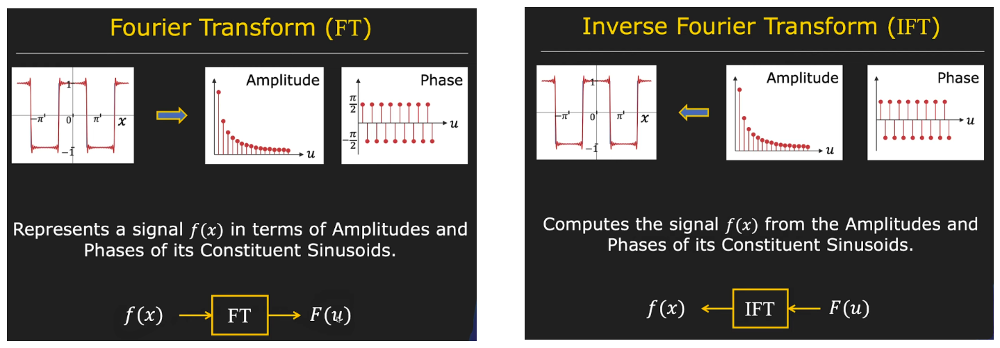

## Image Processing II
The goal of image processing is to transform image to a new one that is clearler or easier to analyze

**Topic Covered**
1. Fourier TRansform
2. Convolution Therorem
3. Deconvolution in Frequency Domain
4. Sampling  Theory and Aliasing

### Furier Transform
Fourier transform is named after Jean Baptiste Josep Fourier(1768-1839). Basic defination of Fourier transform is **Amy Periodic function can be rewritten as a Weighted sum of Infinite Sinusoids of Different Frequencies**

The Fourier Transform is a mathematical operation that transforms a signal from its original domain (often time or space) into the frequency domain. It expresses a function as a sum (or integral) of sinusoidal functions (sine and cosine waves) with varying frequencies, amplitudes, and phases.

Given a time-domain signal $f(t)$, its Fourier Transform $F(\omega)$ is defined as:

$$
F(\omega) = \int_{-\infty}^{\infty} f(t) e^{-i \omega t} \, dt
$$

Where:
- $f(t)$ is the original function in the time domain,
- $\omega$ is the angular frequency,
- $e^{-i \omega t}$ represents a complex sinusoidal function,
- $F(\omega)$ is the transformed function in the frequency domain.

### Inverse Fourier Transform (IFT)
The Inverse Fourier Transform is used to recover the original time-domain signal from its frequency-domain representation. It essentially reverses the process of the Fourier Transform.

Given a frequency-domain function $F(\omega)$, its inverse Fourier Transform $f(t)$ is defined as:

$$
f(t) = \frac{1}{2\pi} \int_{-\infty}^{\infty} F(\omega) e^{i \omega t} \, d\omega
$$

Where:
- $F(\omega)$ is the function in the frequency domain,
- $\omega$ is the angular frequency,
- $e^{i \omega t}$ represents a complex sinusoidal function,
- $f(t)$ is the recovered function in the time domain.

#### Why Fourier transform Complex?

1. **Why Complex?** The Fourier transform uses complex numbers because the coefficient $F(u)$ for a given frequency $u$ needs to capture both the amplitude and the phase of the corresponding sinusoid. This complexity is necessary for the transform to fully and accurately represent the signal.

2. **Positive and Negative Frequencies:** The Fourier transform considers both positive and negative frequencies, not just from zero to infinity. This allows the transform to encompass all frequency components of the signal.

3. **Amplitude and Phase:** For each frequency $u$, the Fourier transform $F(u)$ has real and imaginary components. The amplitude of the sinusoid at that frequency is the square root of the sum of the squares of the real and imaginary parts. The phase is determined by taking the inverse tangent of the imaginary part divided by the real part.

[Diagram of signal and its equivalent FT](./images/signal_to_ft.gif)
### Properties of Fourier Transform
1. **Linearity:** The Fourier Transform of a sum of functions is the sum of their Fourier Transforms.
2. **Time Shifting:** Shifting a function in time corresponds to a phase shift in its frequency representation.
3. **Frequency Shifting:** Shifting a function in frequency corresponds to a time shift in its time-domain representation.
4. **Scaling:** Rescaling a function in time domain corresponds to inverse scaling in the frequency domain (and vice versa).
5. **Convolution:** The Fourier Transform of a convolution of two functions is the product of their individual Fourier Transforms.

### Applications
- Signal processing
- Image processing
- Communication systems
- Audio and video compression
- Solving partial differential equations

### References:
- [Decomposing the Fourier Transforms - dibsmethodsmeetings.github.io](https://dibsmethodsmeetings.github.io/fourier-transforms/)