# Image Processing

In image processing, the goal is often to enhance images to make them clearer or more suitable for analysis. For example, if an image is defocused and appears blurred, we aim to remove the blur to improve clarity.

Key Concepts:
- **Pixel Processing**
- **Linear Shift Invariant Systems (LSIS) and Convolution**
- **Linear Image Filters**
- **Non-Linear Image Filters**
- **Template Matching by Correlation**

### Pixel (Point) Processing

An image can be viewed as a function $ f(x, y) $ at point $(x, y)$. A transformation $ T $ applies to the intensity $ f $ at each pixel, resulting in a new intensity $ g $:

$$
g(x, y) = T(f(x, y))
$$

Each pixel operation is independent of other pixel values. Examples of such transformations include:
- **Image Inversion**: $ 255 - f $
- **Lightening**: $ f + 128 $
- **Darkening**: $ f - 128 $
- **Low Contrast**: $ f / 2 $
- **High Contrast**: $ f \times 2 $
- **Grayscale Conversion**: $ 0.3 f_r + 0.6 f_g + 0.1 f_b $

### Linear Shift Invariant Systems (LSIS)

An LSIS system is characterized by linearity and shift invariance:
- **Linearity**: If $ f_1 $ transforms to $ g_1 $ and $ f_2 $ transforms to $ g_2 $, then $ a f_1 + b f_2 $ transforms to $ a g_1 + b g_2 $.
- **Shift Invariance**: If $ f(x) $ transforms to $ g(x) $, then $ f(x - a) $ transforms to $ g(x - a) $.

An ideal example of an LSIS is a lens: brightness variation is linear, and shift invariance means that if an object moves, it moves through the lens by the same factor.

**Convolution**
Convolution combines two functions $ f(x) $ and $ h(x) $ to produce a third function $ g(x) $:
$$
g(x) = f(x) * h(x) = \int_{-\infty}^{\infty} f(\tau) h(x - \tau) \, d\tau
$$

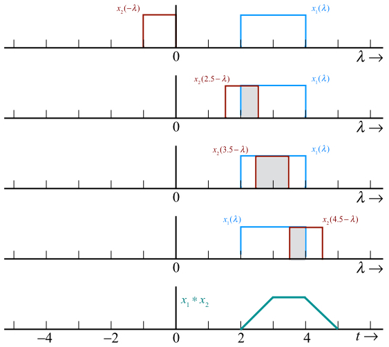

**Note:** "Convolve" and "convolution" are related but distinct concepts. Convolution involves sliding a kernel (or filter) over an input image and computing the sum of element-wise multiplications between the kernel and the image segment.

Convolution is an LSIS operation, meaning it satisfies both linearity and shift invariance properties.

**Shifting Function:** Convolution of a shifting function with a unit impulse function yields the original function, demonstrating the shifting property.

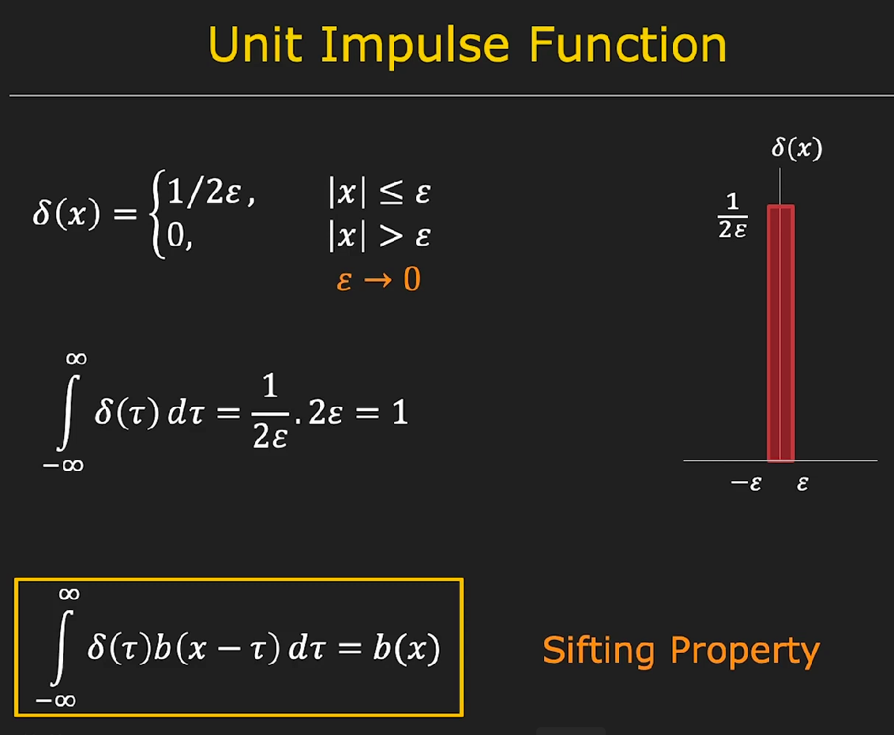

To obtain $ h(x) $, convolve with an impulse function. $ h(x) $ is known as the impulse response function in convolution.

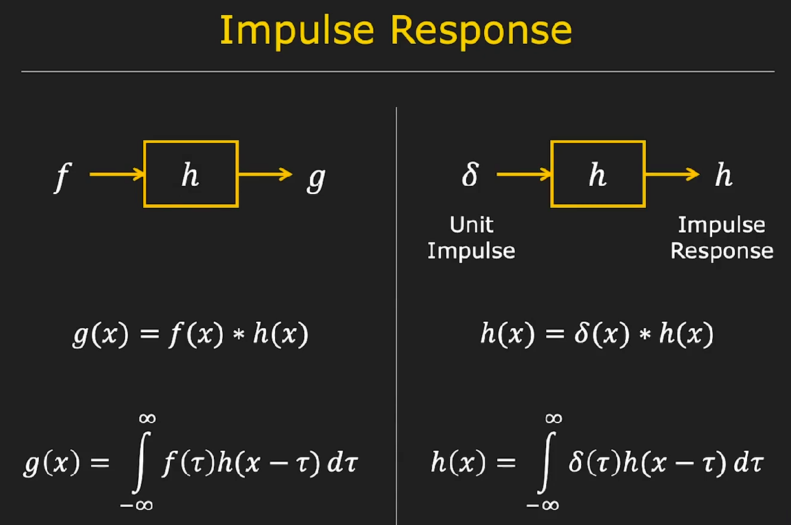

**Properties of Convolution:**
- **Commutative**: $ a * b = b * a $
- **Associative**: $ a * (b * c) = (a * b) * c $

**2D Convolution** extends these concepts to two-or higher dimensional images.

Here is a rewritten version of the continuous 2D convolution formula:

$$
g(x, y) = (f * h)(x, y) = \int_{-\infty}^{\infty} \int_{-\infty}^{\infty} f(\xi, \tau) \cdot h(x - \xi, y - \tau) \, d\xi \, d\tau
$$

### Convolution in Discrete Images

Convolution is a fundamental operation in image processing, used to enhance or extract information from images. In discrete image convolution, we flip the kernel (or mask) horizontally and vertically, then slide it over the image to compute the convolution response. 

#### Convolution Operation
For a discrete image $f[i, j]$ with dimensions $m \times n$, and a convolution kernel $h[i, j]$, the output image $g[i, j]$ is computed as:
$$
 g[i, j] = \sum_{m} \sum_{n} f[m, n] \cdot h[i - m, j - n] 
 $$
where $h$ is flipped both horizontally and vertically.

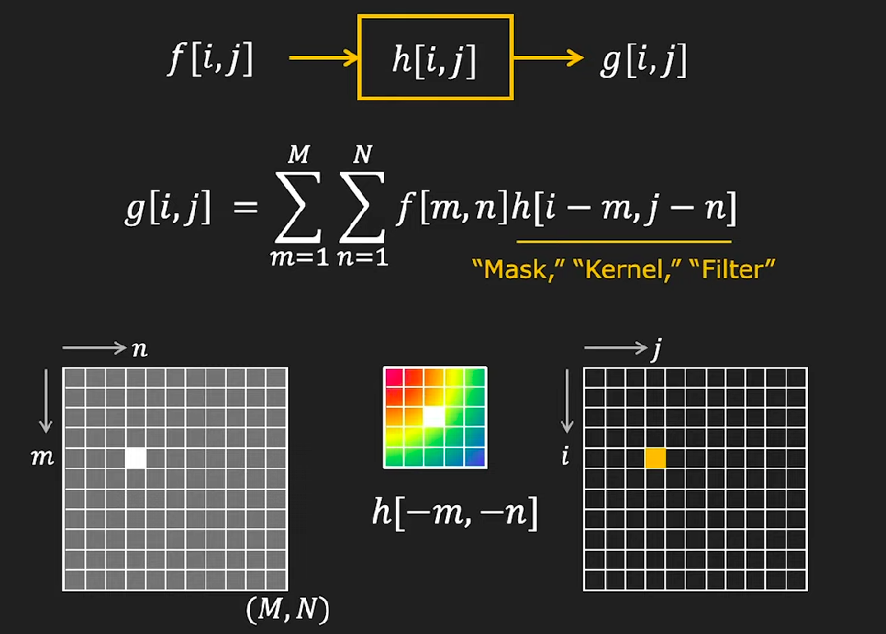

#### Handling Border Issues

When applying convolution, handling borders is essential to ensure accurate results:

- **Ignore the Border:** Convolution is applied only to pixels where the kernel fits entirely within the image. This results in losing information at the borders of the image.
- **Pad with Constant Value:** Extend the image with additional rows and columns filled with a constant value (e.g., average brightness) to handle border issues.
- **Pad with Reflection:** Extend the image by reflecting the pixel values at the borders, creating a mirror effect to seamlessly handle border pixels.

### Examples of Linear

1. **Impulse Filter:**
   Applying an impulse function (delta function) as the convolution kernel retains the original image. The output image is the same as the input image because the impulse function essentially samples the input image directly.

2. **Image Shift:**
   Shifting the impulse function to a corner of the kernel results in shifting the entire image in the opposite direction. For example, shifting the impulse function to the bottom-right corner of the mask will shift the image down and to the right.

   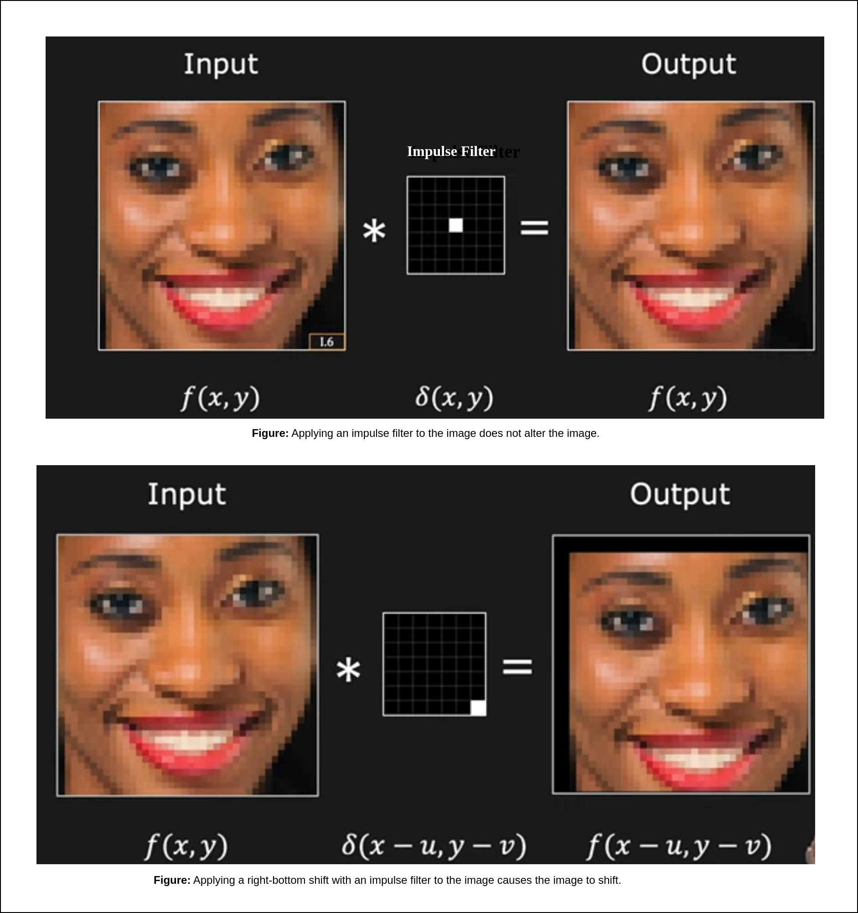
3. **Box Filter (Averaging Filter):**
   A box filter with constant value $1$ in a $5 \times 5$ kernel smooths the image by averaging the pixel values within the kernel size. However, this can lead to saturation, where pixel values exceed the image's dynamic range (e.g., 0-255 in 8-bit images). To avoid saturation, normalize the box filter by dividing the kernel values by the total number of pixels in the kernel (e.g., $1/25$ for a $5 \times 5$ filter). This normalization ensures that the output image retains similar brightness to the input image while achieving the smoothing effect.

   

#### Gaussian Kernel: Fuzzy Filter

Box filters can introduce blocky artifacts, which are undesirable. To address this, a **fuzzy filter** or **Gaussian filter** is used. A fuzzy filter has higher intensity at the center and gradually decreases towards the edges, providing a smoother and more natural-looking result. The Gaussian filter is rotationally symmetric and avoids blocky artifacts.

**Gaussian Function:**
The Gaussian filter is defined by:
$$
 h[i, j] = \frac{1}{2 \pi \sigma^2} e^{-\frac{i^2 + j^2}{2 \sigma^2}} 
 $$
where $\sigma$ is the standard deviation of the Gaussian function. The Gaussian function is normalized to ensure that the total area under the curve is 1, irrespective of the size of the mask.

**Choosing the Mask Size:**
The size of the Gaussian mask can be approximated as $k \approx 2 \sigma$, where $k$ is the mask size. This size captures most of the Gaussian's energy while remaining computationally feasible.

#### Gaussian Smoothing and Separable Filters

Gaussian smoothing is separable, meaning a 2D Gaussian filter can be decomposed into two 1D Gaussian filters—one for the rows and one for the columns. This separation simplifies computation:

1. Convolve the image with a 1D Gaussian filter along the rows.
2. Convolve the result with another 1D Gaussian filter along the columns.

This approach reduces computational complexity compared to directly applying a 2D Gaussian filter. 

**Computational Efficiency:**
Applying a separable filter is computationally more efficient:
- Direct 2D convolution requires $k^2$ multiplications and additions per pixel.
- Separable 1D convolution requires $2k$ multiplications and $2k - 1$ additions, which is significantly less for large $k$.

### Non-Linear Image Processing

Non-linear filters apply non-linear operations to pixel values within a local neighborhood. Unlike linear filters, which rely on simple weighted sums, non-linear filters involve more complex relationships between pixels. Common examples of non-linear filters include **median filtering** and **bilateral filtering**.

#### Smoothing to Remove Noise

Consider **salt-and-pepper noise**, which consists of randomly scattered black and white pixels that can obscure important details like object edges. To reduce such noise, one common approach is **Gaussian smoothing**, where pixel values are averaged within a local region. While this method can effectively reduce noise, it also blurs edges and reduces image detail.

For images with salt-and-pepper noise, a filter that reduces noise while preserving edge sharpness is needed. The **Median filter** is ideal in such cases. It is a non-linear filter that works by examining the pixel neighborhood (e.g., a 3x3 area), sorting the pixel values, and selecting the median value as the new pixel value. This process helps preserve edges while removing the noise.

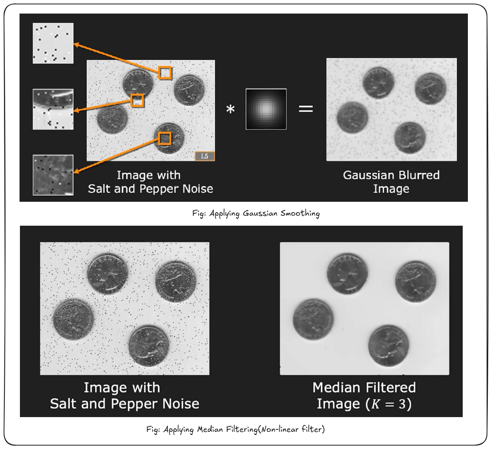

However, larger median filters may result in over-smoothing, potentially losing important image details. The median filter is effective for simple noise but may have limitations when applied to more complex images.

#### Problems with Gaussian Smoothing

- **Gaussian smoothing** works well in uniform or "flat" regions but struggles with preserving edges, especially in textured areas.
- Since Gaussian smoothing applies the same filter to every pixel without considering local image structure, it tends to blur edges and erase fine details (such as digits or textures).

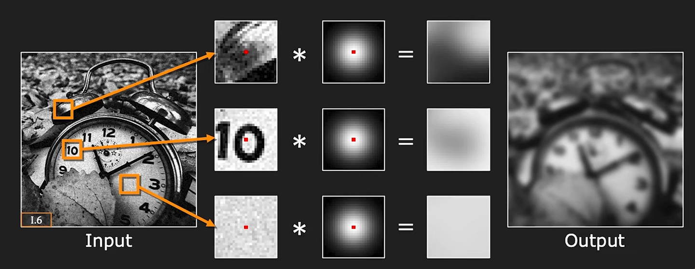

#### Bilateral Filtering

**Bilateral filtering** is a non-linear filter that takes into account two factors:

1. **Spatial Gaussian**: Similar to Gaussian smoothing, this factor gives more weight to pixels that are closer to the center pixel in terms of spatial distance.
   
2. **Brightness Gaussian**: This factor adjusts the weights based on the difference in intensity (brightness) between the center pixel and its neighbors. If the intensity difference is small, the neighboring pixel receives a higher weight; if the difference is large, it gets a lower weight.

The key advantage of bilateral filtering is its ability to smooth noise while preserving edges. The filter adapts to the local structure of the image, assigning lower weights to pixels across edges, where intensity differences are large, and higher weights to pixels with similar intensities.

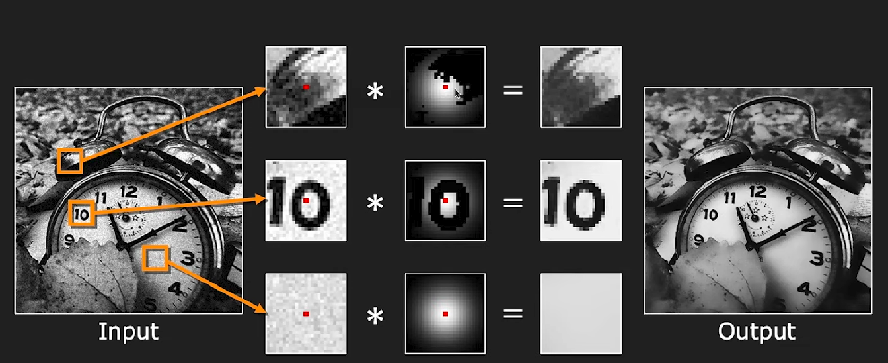

**Steps of Bilateral Filtering:**

1. For each pixel, calculate a spatial Gaussian filter based on the distance from the center pixel.
2. Apply a **brightness Gaussian** based on the intensity difference between the center pixel and its neighbors.
3. Combine the spatial and brightness Gaussian filters to produce a weighted average for the pixel.
4. Normalize the weights to ensure the output pixel value is balanced.

- **Effect**: Bilateral filtering results in a **smoother image** with reduced noise, while **preserving edges** better than Gaussian smoothing.

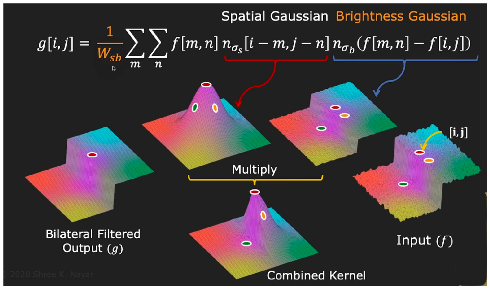

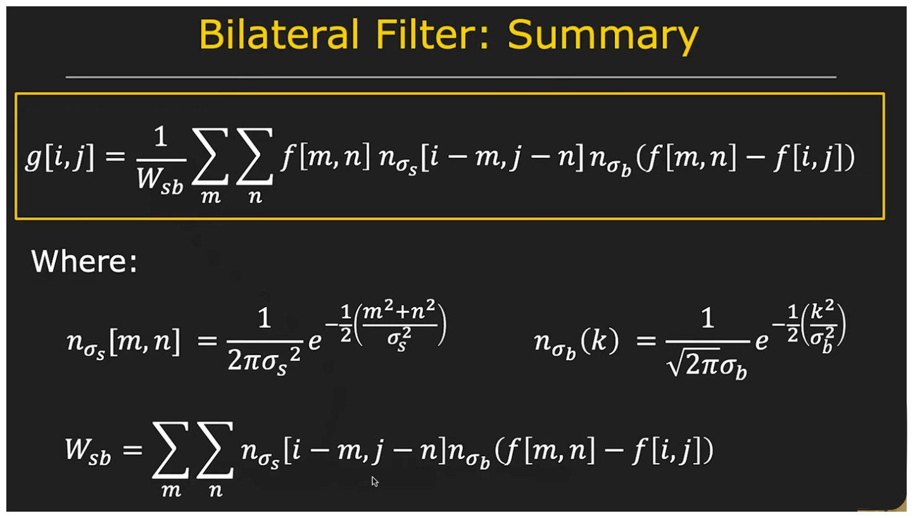

#### Bilateral Filtering: Practical Example

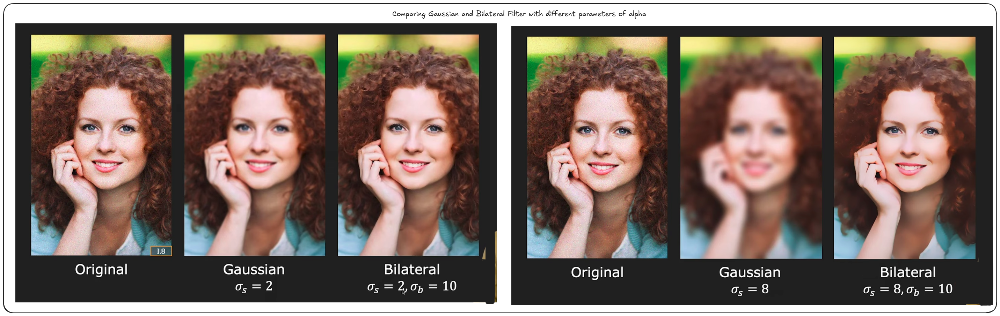

**Adjusting Bilateral Filter Parameters:**

- **Spatial Sigma (σ)**: This parameter controls the extent of smoothing based on spatial proximity. A larger spatial sigma will smooth a larger area around each pixel but may blur fine details, such as textures or edges in intricate areas like hair or patterns.
  
- **Brightness Sigma (σ)**: This parameter controls how much difference in pixel intensities can be tolerated. A higher value allows more neighboring pixels to influence the output, making the filter behave more like a Gaussian filter. If brightness sigma is set too high, the bilateral filter loses its edge-preserving property and behaves similarly to Gaussian smoothing, blurring edges and fine details.

### Template Matching through Correlation

Template matching by correlation is a technique used to find a smaller template or pattern within a larger image. The aim is to determine the position where the template matches the image as closely as possible, even with slight variations like changes in lighting or orientation. The process involves sliding the template over the image, comparing it at each position, and identifying the location that provides the best fit.

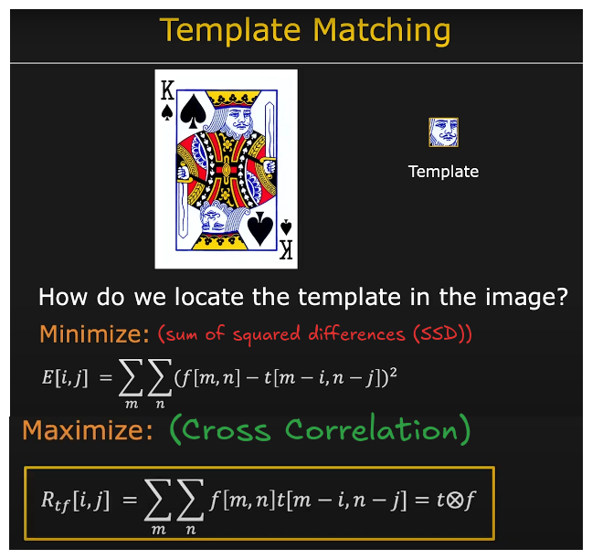

#### Key Concepts:

1. **Template Matching Process**:
   - Two inputs are given: a **template** (small pattern) and an **image** (larger image).
   - The objective is to locate the template within the image by finding regions where it fits well.
   - This is achieved by **sliding** the template across the image and calculating the match quality at each position.

2. **Difference Measurement**:
   - For each template position in the image, a **metric** is used to calculate the difference between the template and the corresponding part of the image.
   - A common metric is the **sum of squared differences (SSD)** between the template and the image portion. A smaller SSD indicates a better match.

   **SSD Formula**:
   $$
      \text{SSD} = \sum_{m} \sum_{n} (f[m,n] - t[m-i,n-j])^2
   $$

   - When the SSD is **zero**, it indicates a perfect match between the template and the image region.

#### Cross-Correlation

**Cross-correlation** extends the idea of measuring differences by calculating a similarity score between the template and the image. A higher score signifies a better match.

1. **Mathematical Formulation**:
   Cross-correlation is defined as:
   $$
   R_{tf}[i,j] = \sum_{m} \sum_{n} f[m,n]t[m-i, n-j] =t \otimes f
   $$ 
   where $t(m,n)$ represents the template and $t[m-i, n-j]$ represents the image at the shifted position.

   - In this case, the template $t$ is **not flipped**, unlike in convolution (another image processing operation), which involves flipping the template before comparing it to the image.
   - The primary difference between cross-correlation and convolution is that the indices shift differently. Cross-correlation doesn't flip the template, whereas convolution does.

2. **Convolution vs. Cross-Correlation**:
   The key distinction is that convolution flips the template before performing the comparison, while cross-correlation does not. This makes cross-correlation computationally simpler in some situations.

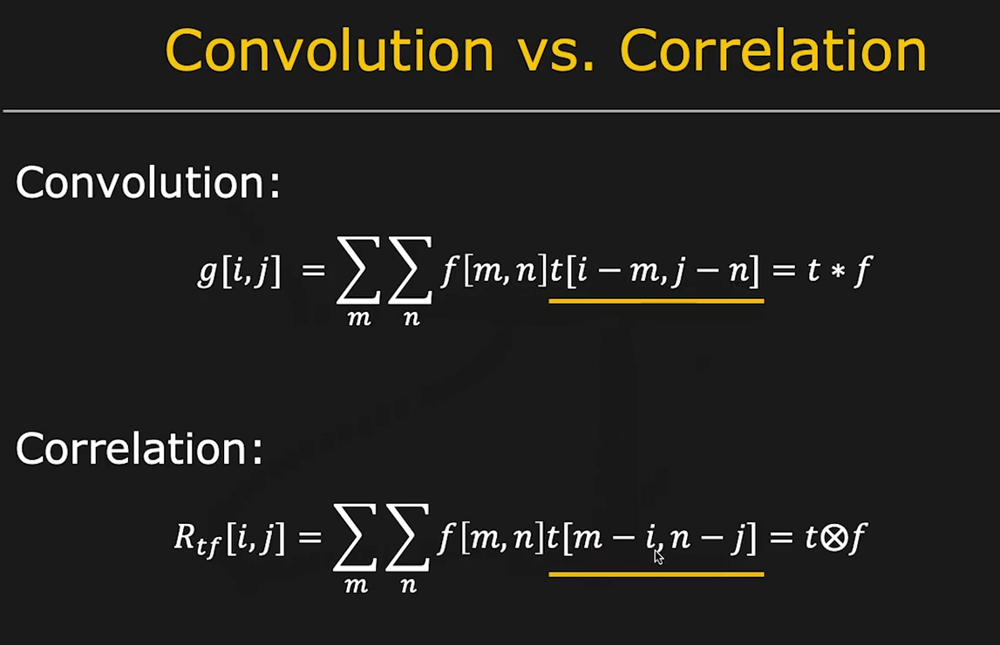

#### Challenges with Cross-Correlation

Although cross-correlation is effective for template matching, it may not always provide accurate results due to variations in **brightness** or **lighting conditions**. This happens when the image and the template match in terms of pattern but differ in intensity or lighting.

1. **Example Problem**: 
   If the template and the image share a similar structure but have different lighting conditions, cross-correlation may yield a high match score for regions with similar brightness, even though they do not exactly match in pattern.

   For instance, if the template is dark and the corresponding image region is bright, cross-correlation might return a high score despite a mismatch in patterns.

2. **Solution: Normalizing Cross-Correlation**:
   To address this issue, **normalization** of the cross-correlation result is applied. Normalization compensates for brightness and contrast changes, making the cross-correlation score more robust to lighting variations.

   The normalized cross-correlation formula is:
   $$
   \text{Normalized Cross-Correlation} = \frac{R_{tf}(i,j)}{\sqrt{E_{\text{image}} \cdot E_{\text{template}}}}
   $$

   where:
   - $E_{\text{image}}$ represents the energy (sum of squared pixel values) of the region of the image overlapping with the template.
   - $E_{\text{template}}$ is the energy of the template.

   Normalization ensures that the template matching process remains **insensitive to brightness changes**, allowing it to perform well even in varying lighting conditions or camera settings.

#### Final Outcome: Accurate Template Matching

After applying normalization, the cross-correlation values are adjusted, ensuring that the highest normalized cross-correlation score corresponds to the best match. This means that:

- The **highest** value in the normalized cross-correlation map will pinpoint the region in the image where the template best matches.
- The template can now be accurately located in the image, even with variations in brightness or lighting.

### Real-World Example

In real-world scenarios, once normalization is applied, the results are much more precise:

- Given a template and a target image, the normalized cross-correlation map is calculated.
- The brightest spot on this map will correspond to the area in the image where the template fits, regardless of changes in lighting or contrast.